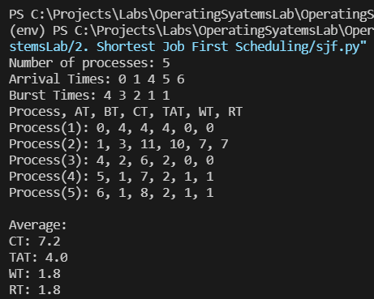

## [Shortest Job First Scheduling](./sjf.py)

Shortest Job First (SJF) is an algorithm in which the process having the smallest execution time is chosen for the next execution. This scheduling method can be preemptive or non-preemptive. It significantly reduces the average waiting time for other processes awaiting execution.
### Code: [sjf.py](./sjf.py)

### Output

