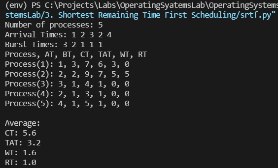

## [Shortest Remaining Time First Scheduling](./srtf.py)

Shortest remaining time first (SRTF), is a scheduling method that is a preemptive version of shortest job next scheduling. In this scheduling algorithm, the process with the smallest amount of time remaining until completion is selected to execute. The process will either run until it completes or get preempted if a new process is added that requires a smaller amount of time.
### Code: [srtf.py](./srtf.py)

### Output

