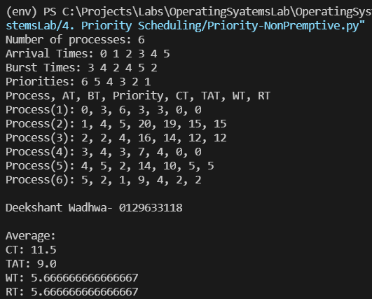
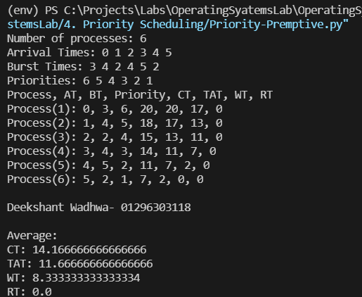

## [Priority Scheduling](./Priority-NonPremptive.py)

Priority Scheduling is a method of scheduling processes that is based on priority. In this algorithm, the scheduler selects the tasks to work as per the priority. The processes with higher priority should be carried out first, whereas jobs with equal priorities are carried out based on first come first serve. Based on preemption of the algorithm it is decided whether or not the current executing algorithm should be replaced (replace if algorithm in premptive, elso not) with the one with higher priority, but if a new task is to be started the individual priority is used to decide order of execution.

### Non Premptive: [Priority-NonPremptive.py](./Priority-NonPremptive.py)

### Output

### Premptive: [Priority-Premptive.py](./Priority-Premptive.py)

### Output

