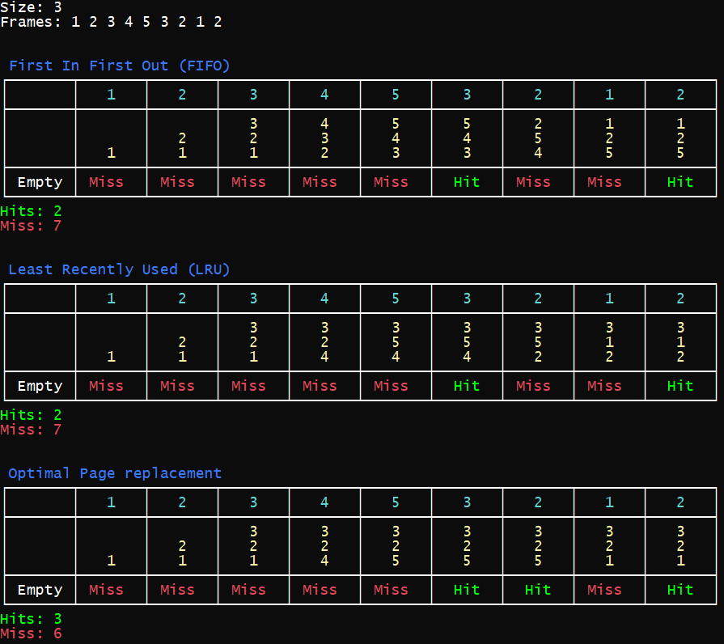
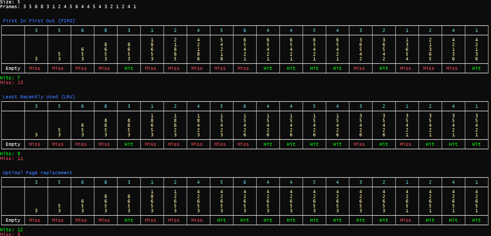

## [Page Replacement Algorithm](./pageReplacement.py)

In an operating system that uses paging for memory management, a page replacement algorithm is needed to decide which page needs to be replaced when new page comes in. A page fault happens when a running program accesses a memory page that is mapped into the virtual address space, but not loaded in physical memory. Since actual physical memory is much smaller than virtual memory, page faults happen. In case of page fault, Operating System might have to replace one of the existing pages with the newly needed page. Different page replacement algorithms suggest different ways to decide which page to replace.
1. First In First Out (FIFO) – In this algorithm, the operating system keeps track of all pages in the memory in a queue, the oldest page is in the front of the queue. When a page needs to be replaced page in the front of the queue is selected for removal. 
2. Optimal Page replacement – In this algorithm, pages are replaced which would not be used for the longest duration of time in the future. 
3. Least Recently Used – In this algorithm page will be replaced which is least recently used. 

### Code: [pageReplacement.py](./pageReplacement.py)

### Output

 

