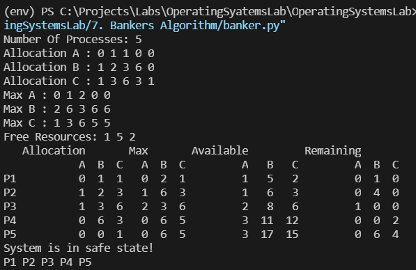

## [Bankers Algorithm](./banker.py)

The banker’s algorithm is a resource allocation and deadlock avoidance algorithm that tests for safety by simulating the allocation for predetermined maximum possible amounts of all resources. When a new process enters a system, it must declare the maximum number of instances of each resource type that it may ever claim; clearly, that number may not exceed the total number of resources in the system. Also, when a process gets all its requested resources it must return them in a finite amount of time.
### Code: [banker.py](./banker.py)

### Output

