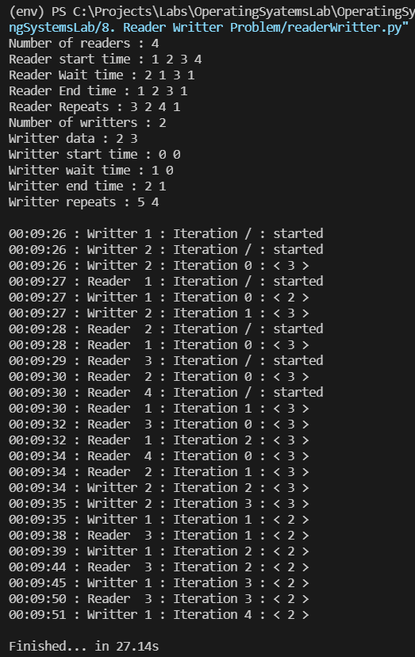

## [Reader Writter Problem](./readerWritter.py)

The readers-writers problem is a classical problem of process synchronization, it relates to a data set such as a file that is shared between more than one process at a time. Among these various processes, some are Readers - which can only read the data set; they do not perform any updates, some are Writers - can both read and write in the data sets. The readers-writers problem is used for managing synchronization among various reader and writer process so that there are no problems with the data sets, i.e. no inconsistency is generated.
### Output

