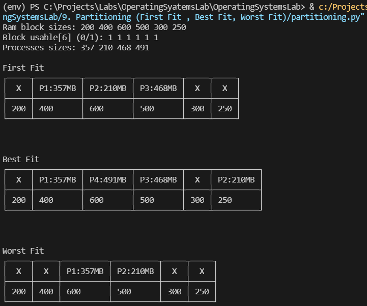

## [Partitioning (First Fit , Best Fit, Worst Fit)](./partitioning.py)
Memory partitioning is the system by which the memory of a computer system is divided into sections for use by the resident programs. These memory divisions are known as partitions. There are different ways in which memory can be partitioned: fixed, variable, and dynamic partitioning.

1. First Fit - In the first fit approach is to allocate the first free partition or hole large enough which can accommodate the process. It finishes after finding the first suitable free partition.

2. Best Fit - The best fit deals with allocating the smallest free partition which meets the requirement of the requesting process. This algorithm first searches the entire list of free partitions and considers the smallest hole that is adequate. It then tries to find a hole which is close to actual process size needed.

3. Worst fit - In worst fit approach is to locate largest available free portion so that the portion left will be big enough to be useful. It is the reverse of best fit.

### Code: [partitioning.py](./partitioning.py)

### Output

